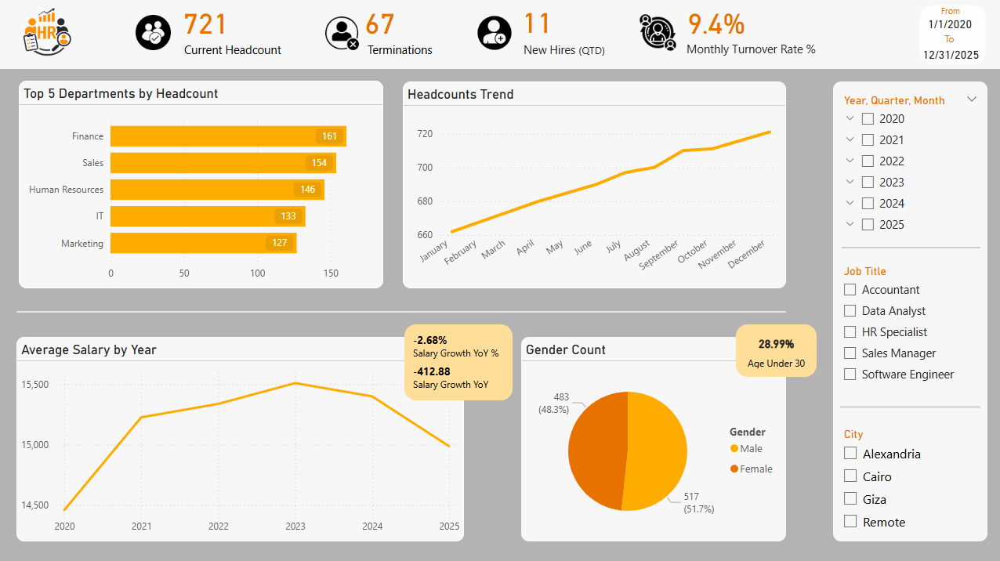
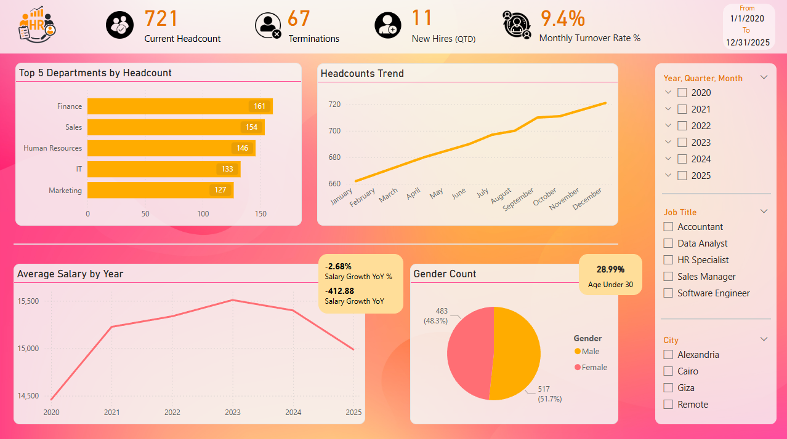
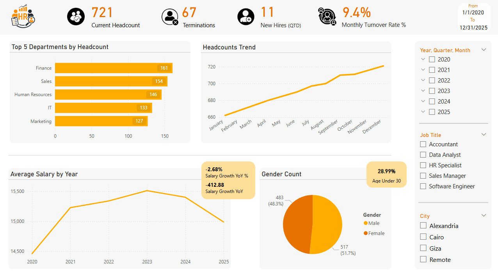

# HR Analytics Dashboard – Power BI

  

Interactive HR Analytics dashboard built from scratch using Power BI, MySQL, and Python. Tracks headcount trends, turnover, salary growth, diversity, and key workforce metrics over 6 years (2020–2025).

## Project Overview

This is a **fully original** HR Analytics project created from the ground up:

- Designed a complete **star-schema database** (13 tables) in MySQL
- Generated 1,000 realistic employees with hire dates back to 2015
- Created ~75,000 monthly snapshots using Python automation and SQL CROSS JOIN
- Built time-intelligent DAX measures for accurate headcount, turnover, and salary trends
- Resolved real-world issues: ambiguous relationships, data type mismatches, snapshot logic
- Exported clean CSV files for full portability (no database required)
- Designed custom logo using Illustrator and AI tools

**Key metrics tracked**:
- Current Headcount & Trend (with YoY comparison)
- Monthly Turnover Rate % (with annualized view)
- New Hires & Terminations
- Average Salary & YoY Growth
- Top Departments by Headcount
- Gender Distribution & % Under 30

## Screenshots

### Main Dashboard – Professional Dark Theme (Recommended)

### Alternative – Colorful Theme

### Alternative – Clean White Theme

## How to View the Dashboard Locally

1. Download **Power BI Desktop** (free): https://powerbi.microsoft.com/desktop/
2. Open `HR_Analytics.pbix`
3. Use slicers (Year, Quarter, Month, Job Title, City) to explore

**No database needed** – dashboard uses included CSV files.

## Files Included

- `HR_Analytics.pbix` – Main dashboard file (CSV-based)
- `hr_analytics_csv/` – Full dataset as CSV files (ready to explore in Excel)
- `export_hr_to_csv.py` – Python script to regenerate CSV files From The SQL Database
- `hr_analytics_schema.sql` – Full MySQL schema + sample data (for advanced users who want to recreate the database)
- `generate_hr_data.py` – The Data Generator Code That Generates Dirctly To the Sql Databse
- `assets/logo/hr-logo.png` – Custom logo designed in Illustrator + AI
- `screenshots/` – All dashboard versions

## Built With

- Power BI Desktop
- DAX (time intelligence, snapshot logic, dynamic measures)
- Power Query (M language)
- MySQL (original database design)
- Python (data generation + CSV export) + Pandas For Cleaning
- Adobe Illustrator + AI tools (custom logo)

**Note on data generation**  
All data was generated using Python scripts for realism (Egyptian names, tenure distribution, random promotions/salaries). Monthly snapshots start in January 2020 to simulate a real HR system launch.

**Project is 100% original** – no copied tutorials. Every measure, relationship, and design decision was built and debugged from scratch.

---
