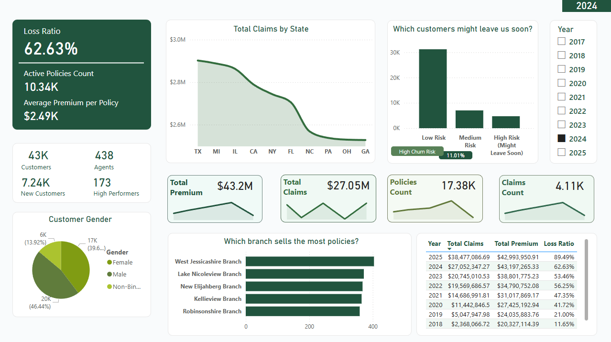
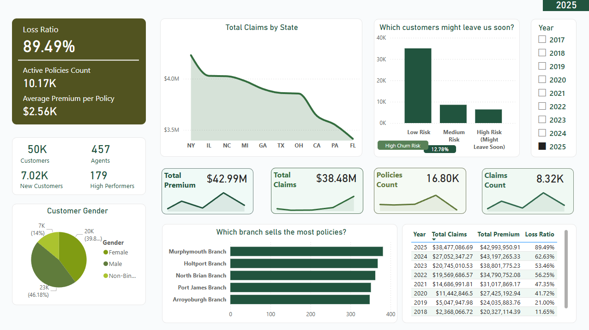

# Insurance Company Performance Dashboard – Power BI

  
  
<i>Interactive Power BI dashboard analyzing premium revenue, claims, loss ratio, agent performance, and customer churn risk</i>

**A complete end-to-end synthetic insurance analytics project** – from database design and realistic data generation to advanced Power BI visualization.

## Project Overview

This dashboard provides a comprehensive view of a fictional U.S. insurance company's performance using over **850,000 rows** of synthetic but highly realistic data.

**Key insights and metrics covered:**
- Yearly premium revenue and growth
- Claims volume and loss ratio (with realistic fluctuation: 50–90% range, including a 2020 spike)
- Agent and branch sales performance
- Customer acquisition, active customer base, and churn risk prediction
- Product breakdown (Auto, Home, Life, Health)
- Geographic trends by state

All visuals are fully interactive and respond dynamically to the **Year slicer** (2017–2025). Card visuals include embedded trend lines that update with year selection.

**Note on originality**  
This project was built 100% from scratch by me – including the full relational database schema, Python data generation logic, realism enhancements (correlations, growth weighting, claim severity factors), and the entire Power BI model, measures, and design.

## Screenshots

### Executive Overview – 2024 Selected

*Key highlights shown (2024 selected): 62.63% Loss Ratio, 43K Total Customers, 438 Agents, 7.24K New Customers, 173 High Performers, $43.2M Total Premium, $27.05M Total Claims, 10.34K Active Policies, $2.49K Average Premium per Policy, 17.38K Policies Count, 4.11K Claims Count, dynamic mini-trend charts in cards, top branches by policies sold (West Jessicashire Branch leading), customer churn risk distribution (11.01% High Risk – "Might Leave Soon"), and customer gender breakdown (46.44% Non-Binary, 39.6% Male, 13.92% Female).*

### Executive Overview – 2025 Selected

*Key highlights shown (2025 selected): 89.49% Loss Ratio, 50K Total Customers, 457 Agents, 7.02K New Customers, 179 High Performers, $42.99M Total Premium, $38.48M Total Claims, 10.17K Active Policies, $2.56K Average Premium per Policy, 16.80K Policies Count, 8.32K Claims Count, dynamic mini-trend charts in cards, top branches by policies sold (Murphy mouth Branch leading), customer churn risk distribution (12.78% High Risk – "Might Leave Soon"), and customer gender breakdown (46.18% Non-Binary, 39.8% Male, 14% Female).*

## How to View the Dashboard Locally

1. Download and install **Power BI Desktop** (free) from Microsoft:  
   https://powerbi.microsoft.com/desktop/
2. Open `Insurance_Dashboard.pbix`
3. Use the **Year slicer** (top-right) to explore different years – all cards, charts, and tables update dynamically
4. If no year is selected, the dashboard shows cumulative/all-time totals

## Files Included

- `Insurance_Dashboard.pbix` – Main interactive dashboard file (data embedded via CSV for portability)
- `data/` – All tables as CSV files (easy import, no database required)
- `code/` 
  - `Generate_Insurance_Data.py` – Full Python script to generate the entire dataset in MySQL
  - `Insurance_Schema.sql` – Complete database schema (CREATE TABLE statements)
  - `Claim_Fix.py` – Standalone script to regenerate claims with improved realism and correct loss ratio control
  - `export_to_csv.py` – Utility to export MySQL tables to CSV
- `assets/` – Custom visuals and logo
- `screenshots/` – Dashboard previews
- `README.md` – This file

## Data & Realism Highlights

- **50,000 customers**, **120,000 policies**, **20,000 claims**, **300,000 payments**
- Realistic correlations: income → credit score → risk score → churn probability
- Company growth: heavily weighted toward recent years (more policies/customers in 2024–2025)
- Agent-branch relationship: 80% of policies sold by agents from the same branch
- Controlled loss ratio: ~60–90% range with natural fluctuation and one 2020 spike (~110%)
- Premium inflation, category-specific claim amounts, fraud flags, and more

**CSV version** is provided for instant access (recruiter-friendly – no setup needed).  
**SQL + Python version** included for anyone who wants to regenerate or modify the data.

## Built With

- Power BI Desktop (modeling, DAX measures, custom visuals)
- Python (Faker, mysql-connector, random) – for synthetic data generation
- MySQL – original database backend
- DAX – advanced time intelligence, USERELATIONSHIP for multi-date filtering, conditional measures

## Skills Demonstrated

- Database design & normalization
- Realistic synthetic data generation at scale
- Python scripting for data pipelines
- Advanced Power BI (relationships, time intelligence, dynamic measures, visual design)
- Business storytelling through data

Feedback welcome! Feel free to reach out if you'd like to discuss the project

---
*Synthetic data generated for educational/portfolio purposes. All customer/agent names and details are fictional.*