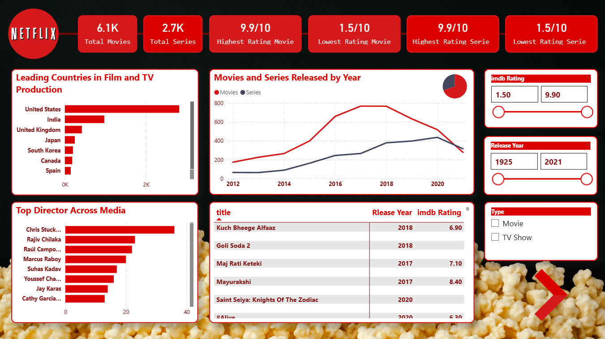
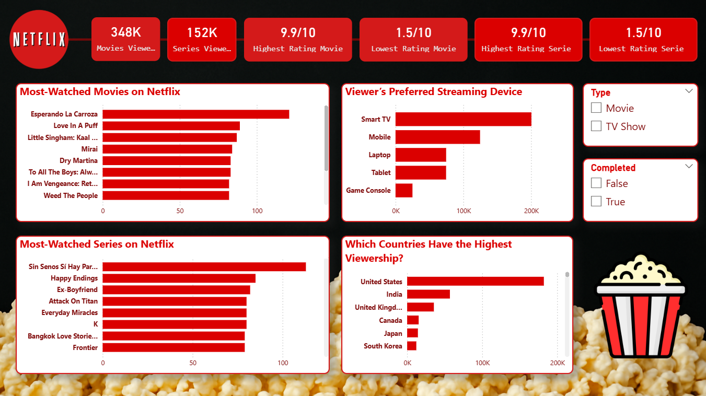

# Netflix Content & Viewer Insights Dashboard – Power BI

  

An engaging, interactive Power BI dashboard analyzing Netflix movies and TV shows, enriched with IMDb ratings and enriched director data. It combines content catalog insights with simulated viewer behavior to reveal viewing patterns, content quality, and audience preferences.

## Project Overview

This two-page dashboard provides actionable insights for content analysts and streaming platform managers, including:

- Total movies and series catalog size
- Highest/lowest rated content (movies and series)
- Most-watched titles and top production countries
- Viewer preferences by device, completion rate, and demographics
- Trends in content release years and director influence

**Note on originality**
This project was built from scratch using the public [Netflix Movies and TV Shows dataset from Kaggle](https://www.kaggle.com/datasets/shivamb/netflix-shows). all visuals, measures, and layout decisions are my own.

To elevate the analysis beyond the raw dataset, I **significantly extended and enriched it** using Python (Pandas):

- Added a new **`imdb_rating`** column and Filled it (originally missing from the dataset)
- Filled missing **`director`** values where possible
- Used a **hybrid enrichment approach**:
  - First: Bulk matching with official **IMDb static datasets** (offline, fast, reproducible)
  - Second: **OMDb API** calls to fill remaining gaps (especially for TV shows and non-English titles)
- Implemented safe, resumable processing with progress tracking and rate-limit handling
- Preserved all original data — only truly missing values were updated
- Removed 6 duplicate rows that caused relationship issues in Power BI (since Power BI wasn't able to detect the duplicates using power query)
- Generated (using python) a **synthetic viewer dataset (~500K rows)** simulating real user watching behavior (device type, completion status, watch duration, etc.)

These enhancements enabled deeper, more meaningful analysis — particularly on Page 2 (Viewer Insights).

For more Detail about the python codes check the README.md file provided on the Python Code Folder

## Screenshots

### Page 1 – Content Overview

### Page 2 – Viewer Behavior Insights

## Quick Access (No Download Needed)
🔗 **Interactive online version**: [Click here to view the dashboard in your browser](https://app.powerbi.com/your-share-link-here)
*(No Power BI installation required – fully interactive)*

## How to View the Dashboard Locally

1. Download and install **Power BI Desktop** (free) from Microsoft:
   https://powerbi.microsoft.com/desktop/
2. Open `Netflix Insights Dashboard.pbix`
3. Navigate between the two pages and interact with slicers (Type, Completed, IMDb Rating, Release Year)

## Files Included

- `Netflix Insights Dashboard.pbix` – Main dashboard file
- `data/netflix_titles_enriched.csv` – Enriched catalog dataset (with added IMDb ratings and directors)
- `data/netflix_viewer_data.csv` – Simulated viewer behavior dataset (500K rows, generated via Python)
- `assets/` – Custom Netflix-style logo and icons
- `enrichment_script.py` – Python (Pandas) code for data enrichment and viewer data generation

## Built With

- Power BI Desktop
- DAX for custom measures (e.g., Highest/Lowest Rating Movie/Series, Viewer counts, etc.)
- Python (Pandas) for advanced data enrichment, synthetic viewer data creation and for cleaning and analyzing
- IMDb static datasets + OMDb API for reliable external data integration
- Image generation using AI (the popcorn background)
- Custom red/black Netflix-inspired theme and layout

This project strengthened my end-to-end data analytics skills: from raw public data → intelligent enrichment using Python → insightful, interactive visualization in Power BI.

---

*Note: The viewer dataset is synthetically generated to simulate realistic watching patterns (device usage, completion rates, etc.) while preserving privacy and enabling audience behavior analysis. The catalog dataset was responsibly enriched using public sources (IMDb/OMDb) for educational purposes only.*
